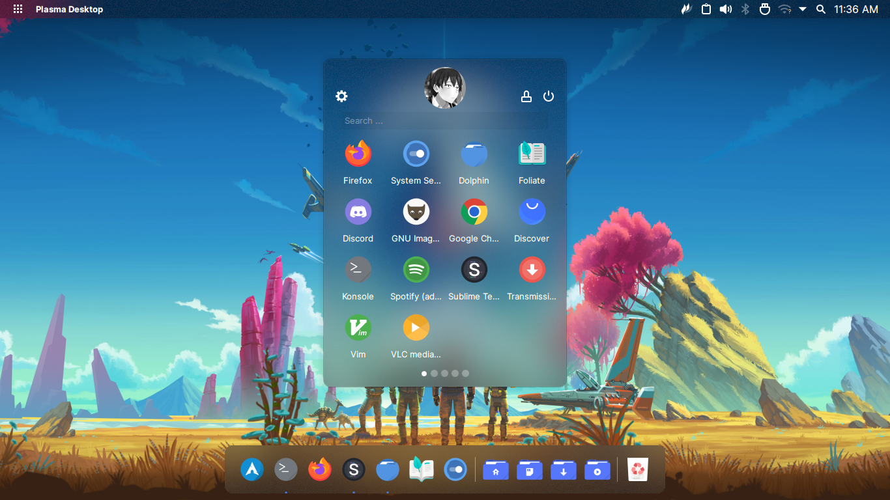

# the glorious plasma setup
A mini dotfiles repository that will remind me my KDE Plasma workflow

 <i>the glorious kde plasma setup</i>

## Details

+ `Plasma Style`: WhiteSur-dark
+ `Kvantum Theme`: WhiteSur-dark
+ `Application Style`: Kvantum
+ `Window Decorations`: Sierra Breeze Enhanced
+ `Colors`: WhiteSurDark
+ `System Fonts`: Inter and Roboto
+ `Icon theme`: Tela Circle blue dark, Papirus
+ `Cursor theme`: Vimix
+ `Wallpaper`: [No Man's Sky : NEXT 8k Ultrawide](https://wall.alphacoders.com/big.php?i=921802)
+ `Lockscreen`: [Subnautica](https://wall.alphacoders.com/big.php?i=988615)
+ `Login Screen`: SDDM
	- `Theme`: Breeze
	- `Background`: [The Legend of Zelda: Breath of the Wild](https://wall.alphacoders.com/big.php?i=805656)
+ `Splash Screen`: Breeze
+ `Widgets`
	- Top Panel
		- Kpple Menu
		- Window Title
		- Global Menu
		- System Tray
		- Event Calendar
		- Latte Spacers
	- Latte Dock
		- Ditto Menu
		- Latte Separators
		- Folder Views
		- Trash
+ `Latte Dock`
	- `Version`: [Master - Latest Commit](https://github.com/KDE/latte-dock)
	- `Theme`: [glorious](https://github.com/manilarome/the-glorious-plasma-setup/blob/master/glorious.layout.latte)
+ `KWin Scripts`
	- `Force Blur`: Force-enable Blur effect for certain windows
+ `Virtual Desktops`
	- Terminal Emulators
	- Internet
	- Text Editors
	- File Managers
	- Medias
	- Games and Emulators
	- Graphics
	- Workspace

## TODO:

- [ ] Learn QML
- [ ] Create my own themes
- [ ] Create my own widgets
